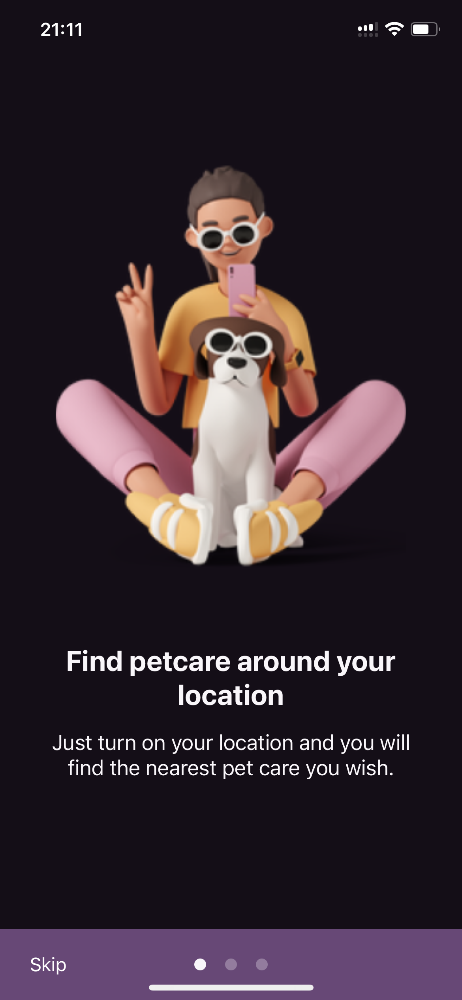
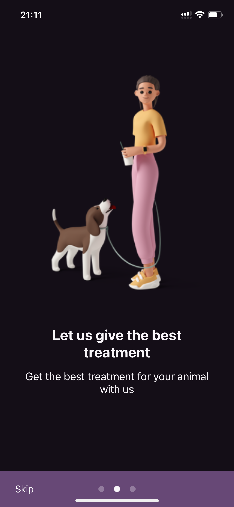
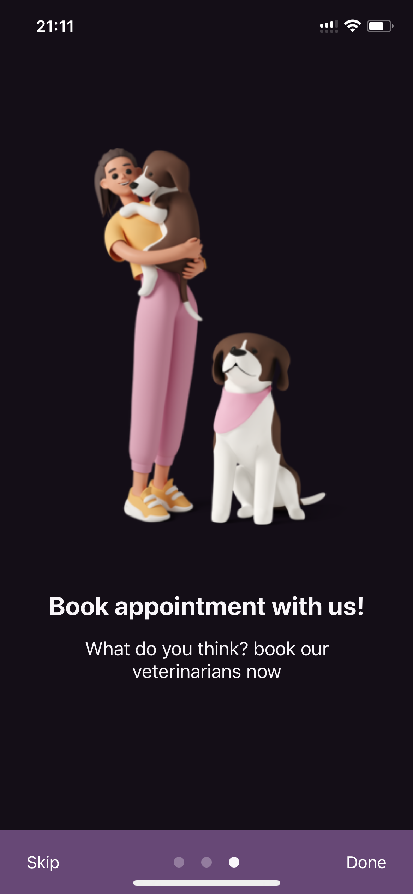

# react-native-app-onboard
[](https://www.npmjs.com/package/react-native-app-onboard) [](https://github.com/julekgwa/react-native-app-onboard) [](https://unpkg.com/react-native-app-onboard/dist/index.js) 

React Native App Onboard is a customizable, easy-to-use, and efficient library for creating compelling onboarding experiences for your React Native applications. It provides smooth, fluid transitions and animations, with a focus on simplicity and usability.

|  |  |  |
| --------------------- | --------------------- | ------------------ |


[Expo Snack example](https://snack.expo.dev/@lekgwaraj/react-native-app-onboard?platform=ios)

## Installation

```sh
yarn add react-native-app-onboard
```

## Usage

```jsx
import React from 'react';
import { Onboarding } from 'react-native-app-onboard';

const App = () => {
  return (
    <Onboarding
      pages={[
        {
          backgroundColor: '#140E17',
          image: <Image source={require('./images/image1.png')} />,
          title: 'Find petcare around your location',
          subtitle:
            'Just turn on your location and you will find the nearest pet care you wish.',
        },
        {
          backgroundColor: '#140E17',
          image: <Image source={require('./images/image2.png')} />,
          title: 'Let us give the best treatment',
          subtitle: 'Get the best treatment for your animal with us',
        },
        {
          backgroundColor: '#140E17',
          image: <Image source={require('./images/image3.png')} />,
          title: 'Book appointment with us!',
          subtitle: 'What do you think? book our veterinarians now',
        },
      ]}
      onDone={() => console.log('Onboarding completed')}
    />
  );
};

export default App;
```

## Props

| Prop                        | Type                              | Default | Description                                                                 |
|-----------------------------|-----------------------------------|---------|-----------------------------------------------------------------------------|
| `children`                  | `React.ReactNode[]`               |         | Optional. An array of child components to render within the onboarding component. |
| `nextLabel`                 | `string` \| `React.ReactNode`     |         | Optional. Custom label for the "Next" button. Can be a string or a React Node. |
| `skipLabel`                 | `string` \| `React.ReactNode`     |         | Optional. Custom label for the "Skip" button. Can be a string or a React Node. |
| `doneLabel`                 | `string` \| `React.ReactNode`     |         | Optional. Custom label for the "Done" button. Can be a string or a React Node. |
| `showSkip`                  | `boolean`                         | `false` | Optional. Determines whether the "Skip" button is shown. |
| `showNext`                  | `boolean`                         | `true`  | Optional. Determines whether the "Next" button is shown. |
| `showDone`                  | `boolean`                         | `true`  | Optional. Determines whether the "Done" button is shown. |
| `scrollAnimationDuration`   | `number`                          | `500`   | Optional. Duration of the scroll animation in milliseconds. Default is 500. |
| `useNativeDriver`           | `boolean`                         |         | Optional. Determines whether animations should use the native driver. |
| `onDone`                    | `() => void`                      |         | Optional. Callback function that is called when the "Done" button is pressed. |
| `onSkip`                    | `() => void`                      |         | Optional. Callback function that is called when the "Skip" button is pressed. |
| `showPagination`            | `boolean`                         | `true`  | Optional. Determines whether pagination indicators are shown. |
| `scrollEnabled`             | `boolean`                         | `true`  | Optional. Determines whether the onboarding screens are scrollable. |
| `customFooter`              | `(props: { nextPage: () => void }) => React.ReactNode` | | Optional. Function that returns a custom footer component. Receives a `nextPage` function as a prop. |
| `paginationContainerStyle`  | `StyleProp<ViewStyle>`            |         | Optional. Custom style for the pagination container. |
| `buttonRightContainerStyle` | `StyleProp<ViewStyle>`            |         | Optional. Custom style for the container of the button positioned on the right. |
| `buttonLeftContainerStyle`  | `StyleProp<ViewStyle>`            |         | Optional. Custom style for the container of the button positioned on the left. |
| `dotsContainerStyle`        | `StyleProp<ViewStyle>`            |         | Optional. Custom style for the dots container in the pagination. |
| `doneLabelStyle`            | `StyleProp<TextStyle>`            |         | Optional. Custom style for the "Done" label. |
| `skipLabelStyle`            | `StyleProp<TextStyle>`            |         | Optional. Custom style for the "Skip" label. |
| `nextLabelStyle`            | `StyleProp<TextStyle>`            |         | Optional. Custom style for the "Next" label. |
| `containerStyle`            | `StyleProp<ViewStyle>`            |         | Optional. Custom style for the main container of the onboarding component. |
| `imageContainerStyle`       | `StyleProp<ViewStyle>`            |         | Optional. Custom style for the image container. |
| `titleContainerStyle`       | `StyleProp<ViewStyle>`            |         | Optional. Custom style for the title container. |
| `titleStyle`                | `StyleProp<TextStyle>`            |         | Optional. Custom style for the title text. |
| `subtitleStyle`             | `StyleProp<TextStyle>`            |         | Optional. Custom style for the subtitle text. |
| `paginationPosition`        | `'top'` \| `'bottom'`             |         | Optional. Determines the position of the pagination indicators. Can be either 'top' or 'bottom'. |
| `width`                     | `number`                          |         | Optional. Custom width for the onboarding component. |
| `color`                     | `string`                          |         | Optional. Color of the pagination dots. |
| `pages`                     | `Page[]`                          |         | Optional. An array of [`Page`](#page-type) objects to render as the onboarding screens. |

## Page Type

Each `Page` object in the `pages` prop should conform to the following structure:

| Property               | Type                      | Required | Description                                                                 |
|------------------------|---------------------------|----------|-----------------------------------------------------------------------------|
| `title`                | `string`                  | Yes      | The main title text for the page.                                           |
| `subtitle`             | `string`                  | Yes      | The subtitle text for the page, providing additional information.           |
| `image`                | `React.ReactNode`         | Yes      | A React Node representing the image to be displayed on the page.            |
| `backgroundColor`      | `string`                  | Yes      | The background color for the page.                                          |
| `color`                | `string`                  | No       | Optional. The text color for the title and subtitle.                        |
| `width`                | `number`                  | No       | Optional. The width of the page. Can be used to adjust the page width.      |
| `containerStyle`       | `StyleProp<ViewStyle>`    | No       | Optional. Custom styles to be applied to the page's container view.         |
| `imageContainerStyle`  | `StyleProp<ViewStyle>`    | No       | Optional. Custom styles for the container of the image.                     |
| `titleContainerStyle`  | `StyleProp<ViewStyle>`    | No       | Optional. Custom styles for the container of the title.                     |
| `titleStyle`           | `StyleProp<TextStyle>`    | No       | Optional. Custom styles for the title text.                                 |
| `subtitleStyle`        | `StyleProp<TextStyle>`    | No       | Optional. Custom styles for the subtitle text.                              |

### Example Page Object

```json
{
  "title": "Welcome to Our App",
  "subtitle": "This is where your journey begins.",
  "image": <ImageComponent />,
  "backgroundColor": "#FFFFFF",
  "color": "#000000",
  "width": 300,
  "containerStyle": {},
  "imageContainerStyle": {},
  "titleContainerStyle": {},
  "titleStyle": {},
  "subtitleStyle": {}
}
```

## Using the Onboarding Hook

To manage the state and navigation of the onboarding flow more effectively, you can utilize the custom `useOnboarding` hook. This hook provides a convenient way to access and modify the onboarding state, including the current page, whether scrolling is enabled, and functions to navigate through the onboarding screens.

### Features Provided by the `useOnboarding` Hook

- **`currentPage`**: A state variable that tracks the current onboarding screen the user is viewing.
- **`setCurrentPage`**: A function to update the current page state.
- **`scrollEnabled`**: A boolean state that indicates whether the user can scroll through the onboarding screens.
- **`enableScroll`**: A function to enable or disable scrolling.
- **`flatListRef`**: A ref object for the underlying FlatList component, allowing for programmatic control of the scroll position.
- **`numberOfScreens`**: The total number of screens in the onboarding sequence.
- **`nextPage`**: A function to navigate to the next page in the onboarding sequence.
- **`scrollTo`**: A function that scrolls to a specific page in the onboarding flow.
- **`progress`**: A value representing the user's progress through the onboarding screens.
- **`isDone`**: A boolean state that indicates whether the user has completed the onboarding process.

### Example Usage

Here's how you can use the `useOnboarding` hook within an onboarding screen component:

```jsx
import React from 'react';
import { View, Button } from 'react-native';
import { useOnboarding } from './OnboardingContext';

const OnboardingScreen = () => {
  const { nextPage, isDone } = useOnboarding();

  return (
    <View>
      {/* Your screen content goes here */}
      <Button
        title={isDone ? 'Finish' : 'Next'}
        onPress={nextPage}
      />
    </View>
  );
};

export default OnboardingScreen;
```

## Acknowledgements

This component library draws inspiration from the [`react-native-onboarding-swiper`](https://www.npmjs.com/package/react-native-onboarding-swiper) package.

We thank the creators and contributors of `react-native-onboarding-swiper` for their work, which has been a valuable reference in the development of this library.


## Contributing

See the [contributing guide](CONTRIBUTING.md) to learn how to contribute to the repository and the development workflow.

## License

MIT

---

Made with [create-react-native-library](https://github.com/callstack/react-native-builder-bob)
```
