# react-native-app-onboard
[](https://www.npmjs.com/package/react-native-app-onboard) [](https://github.com/julekgwa/react-native-app-onboard) [](https://unpkg.com/react-native-app-onboard/dist/index.js) 

React Native App Onboard is a customizable, easy-to-use, and efficient library for creating compelling onboarding experiences for your React Native applications. It provides smooth, fluid transitions and animations, with a focus on simplicity and usability.

| 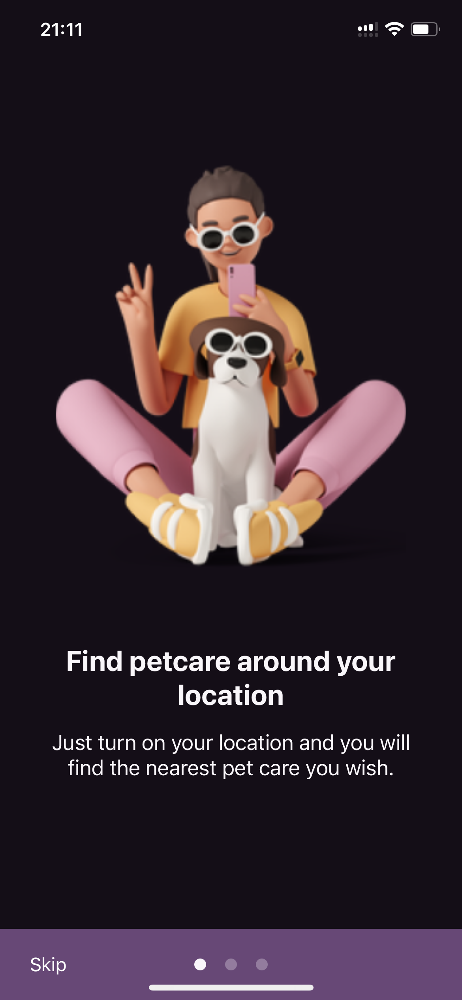 | 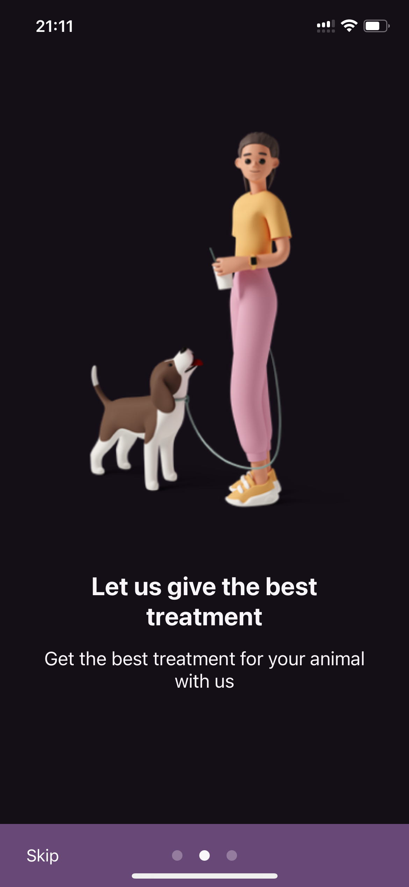 | 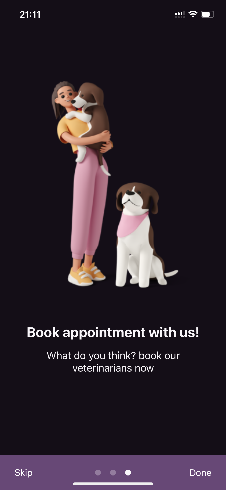 |
| --------------------- | --------------------- | ------------------ |


<a href="https://snack.expo.dev/@lekgwaraj/react-native-app-onboard?platform=ios">
  
</a>

## Features

- Declarative `pages` array or custom child components.
- Animated background-color transitions between pages.
- Pagination as animated dots or a progress bar, with optional tap-to-navigate.
- Skip, Next, Previous, and Done controls with customizable labels and styles.
- Autoplay with optional looping.
- Right-to-left (RTL) support.
- Accessibility support, including screen-reader page announcements.
- `useOnboarding` hook for reading and controlling the flow.
- Custom footer via a render prop.
- Storage-agnostic persistence helpers.
- Optional native-driver animations.
- Written in TypeScript with a single runtime dependency.

## Installation

```sh
yarn add react-native-app-onboard
```

## Usage

```jsx
import React from 'react';
import { Onboarding } from 'react-native-app-onboard';

const App = () => {
  return (
    <Onboarding
      pages={[
        {
          backgroundColor: '#140E17',
          image: <Image source={require('./images/image1.png')} />,
          title: 'Find petcare around your location',
          subtitle:
            'Just turn on your location and you will find the nearest pet care you wish.',
        },
        {
          backgroundColor: '#140E17',
          image: <Image source={require('./images/image2.png')} />,
          title: 'Let us give the best treatment',
          subtitle: 'Get the best treatment for your animal with us',
        },
        {
          backgroundColor: '#140E17',
          image: <Image source={require('./images/image3.png')} />,
          title: 'Book appointment with us!',
          subtitle: 'What do you think? book our veterinarians now',
        },
      ]}
      onDone={() => console.log('Onboarding completed')}
    />
  );
};

export default App;
```

## Props

| Prop                        | Type                              | Default | Description                                                                 |
|-----------------------------|-----------------------------------|---------|-----------------------------------------------------------------------------|
| `children`                  | `React.ReactNode[]`               |         | Optional. An array of child components to render within the onboarding component. |
| `nextLabel`                 | `string` \| `React.ReactNode`     |         | Optional. Custom label for the "Next" button. Can be a string or a React Node. |
| `skipLabel`                 | `string` \| `React.ReactNode`     |         | Optional. Custom label for the "Skip" button. Can be a string or a React Node. |
| `doneLabel`                 | `string` \| `React.ReactNode`     |         | Optional. Custom label for the "Done" button. Can be a string or a React Node. |
| `showSkip`                  | `boolean`                         | `false` | Optional. Determines whether the "Skip" button is shown. |
| `showNext`                  | `boolean`                         | `true`  | Optional. Determines whether the "Next" button is shown. |
| `showDone`                  | `boolean`                         | `true`  | Optional. Determines whether the "Done" button is shown. |
| `showPrevious`              | `boolean`                         | `false` | Optional. Shows a "Back" button (on the left of the footer) once past the first page. |
| `previousLabel`             | `string` \| `React.ReactNode`     | `Back`  | Optional. Custom label for the "Back" button. |
| `scrollAnimationDuration`   | `number`                          |         | Optional. Custom duration (ms) for programmatic page transitions (`nextPage`/`previousPage`/`scrollTo`/autoplay). When unset, the platform's default scroll animation is used. |
| `useNativeDriver`           | `boolean`                         | `false` | Optional. Drives the pagination dot animation on the native thread for smoother performance. The background-color transition always stays JS-driven. |
| `rtl`                       | `boolean`                         | `I18nManager.isRTL` | Optional. Renders the slider right-to-left. Defaults to the device direction; set explicitly to force a direction (applies to the declarative `pages` API). |
| `onDone`                    | `() => void`                      |         | Optional. Callback function that is called when the "Done" button is pressed. |
| `onSkip`                    | `() => void`                      |         | Optional. Callback function that is called when the "Skip" button is pressed. |
| `onPageChange`              | `(index: number) => void`         |         | Optional. Called with the new page index on every page change (swipe, button, or autoplay). Useful for analytics. |
| `showPagination`            | `boolean`                         | `true`  | Optional. Determines whether pagination indicators are shown. |
| `paginationStyle`           | `'dots'` \| `'progress'`          | `'dots'`| Optional. Renders the pagination as animated dots or as a progress bar. |
| `progressBarStyle`          | `StyleProp<ViewStyle>`            |         | Optional. Custom style for the progress bar track (when `paginationStyle="progress"`). |
| `progressBarFillStyle`      | `StyleProp<ViewStyle>`            |         | Optional. Custom style for the progress bar fill (when `paginationStyle="progress"`). |
| `dotsAreTappable`           | `boolean`                         | `false` | Optional. When `true`, tapping a pagination dot scrolls to that page. |
| `scrollEnabled`             | `boolean`                         | `true`  | Optional. Determines whether the onboarding screens are scrollable. |
| `autoPlay`                  | `boolean`                         | `false` | Optional. Automatically advances through the pages. Pauses as soon as the user scrolls manually. |
| `autoPlayInterval`          | `number`                          | `3000`  | Optional. Delay (ms) between automatic page advances when `autoPlay` is enabled. |
| `loop`                      | `boolean`                         | `false` | Optional. Wraps navigation around at either end (used by autoplay and the Next/Back buttons). |
| `customFooter`              | `(props: { nextPage: () => void }) => React.ReactNode` | | Optional. Function that returns a custom footer component. Receives a `nextPage` function as a prop. |
| `paginationContainerStyle`  | `StyleProp<ViewStyle>`            |         | Optional. Custom style for the pagination container. |
| `buttonRightContainerStyle` | `StyleProp<ViewStyle>`            |         | Optional. Custom style for the container of the button positioned on the right. |
| `buttonLeftContainerStyle`  | `StyleProp<ViewStyle>`            |         | Optional. Custom style for the container of the button positioned on the left. |
| `dotsContainerStyle`        | `StyleProp<ViewStyle>`            |         | Optional. Custom style for the dots container in the pagination. |
| `doneLabelStyle`            | `StyleProp<TextStyle>`            |         | Optional. Custom style for the "Done" label. |
| `skipLabelStyle`            | `StyleProp<TextStyle>`            |         | Optional. Custom style for the "Skip" label. |
| `nextLabelStyle`            | `StyleProp<TextStyle>`            |         | Optional. Custom style for the "Next" label. |
| `previousLabelStyle`        | `StyleProp<TextStyle>`            |         | Optional. Custom style for the "Back" label. |
| `containerStyle`            | `StyleProp<ViewStyle>`            |         | Optional. Custom style for the main container of the onboarding component. |
| `imageContainerStyle`       | `StyleProp<ViewStyle>`            |         | Optional. Custom style for the image container. |
| `titleContainerStyle`       | `StyleProp<ViewStyle>`            |         | Optional. Custom style for the title container. |
| `titleStyle`                | `StyleProp<TextStyle>`            |         | Optional. Custom style for the title text. |
| `subtitleStyle`             | `StyleProp<TextStyle>`            |         | Optional. Custom style for the subtitle text. |
| `paginationPosition`        | `'top'` \| `'bottom'`             |         | Optional. Determines the position of the pagination indicators. Can be either 'top' or 'bottom'. |
| `width`                     | `number`                          |         | Optional. Custom width for the onboarding component. |
| `color`                     | `string`                          |         | Optional. Color of the pagination dots. |
| `pages`                     | `Page[]`                          |         | Optional. An array of [`Page`](#page-type) objects to render as the onboarding screens. |
| `skipButtonContainerStyle`  | `StyleProp<ViewStyle>`            |         | Optional. Custom style for the container of the "Skip" button. |
| `nextButtonContainerStyle`  | `StyleProp<ViewStyle>`            |         | Optional. Custom style for the container of the "Next" button. |
| `doneButtonContainerStyle`  | `StyleProp<ViewStyle>`            |         | Optional. Custom style for the container of the "Done" button. |
| `previousButtonContainerStyle` | `StyleProp<ViewStyle>`         |         | Optional. Custom style for the container of the "Back" button. |
| `skipButtonPosition`        | `'top-left'` \| `'top-right'`     |         | Optional. Specifies the position of the "Skip" button. Can be either 'top-left' or 'top-right'. |
| `swap`            | `boolean`                 | false       | Optional. If true, swaps the positions of the title/subtitle and image.     |

## Page Type

Each `Page` object in the `pages` prop should conform to the following structure:

| Property               | Type                      | Required | Description                                                                 |
|------------------------|---------------------------|----------|-----------------------------------------------------------------------------|
| `title`                | `string`                  | Yes      | The main title text for the page.                                           |
| `subtitle`             | `string`                  | Yes      | The subtitle text for the page, providing additional information.           |
| `image`                | `React.ReactNode`         | Yes      | A React Node representing the image to be displayed on the page.            |
| `backgroundColor`      | `string`                  | Yes      | The background color for the page.                                          |
| `color`                | `string`                  | No       | Optional. The text color for the title and subtitle.                        |
| `width`                | `number`                  | No       | Optional. The width of the page. Can be used to adjust the page width.      |
| `containerStyle`       | `StyleProp<ViewStyle>`    | No       | Optional. Custom styles to be applied to the page's container view.         |
| `imageContainerStyle`  | `StyleProp<ViewStyle>`    | No       | Optional. Custom styles for the container of the image.                     |
| `titleContainerStyle`  | `StyleProp<ViewStyle>`    | No       | Optional. Custom styles for the container of the title.                     |
| `titleStyle`           | `StyleProp<TextStyle>`    | No       | Optional. Custom styles for the title text.                                 |
| `subtitleStyle`        | `StyleProp<TextStyle>`    | No       | Optional. Custom styles for the subtitle text.                              |

### Example Page Object

```json
{
  "title": "Welcome to Our App",
  "subtitle": "This is where your journey begins.",
  "image": <ImageComponent />,
  "backgroundColor": "#FFFFFF",
  "color": "#000000",
  "width": 300,
  "containerStyle": {},
  "imageContainerStyle": {},
  "titleContainerStyle": {},
  "titleStyle": {},
  "subtitleStyle": {}
}
```

## Using the Onboarding Hook

To manage the state and navigation of the onboarding flow more effectively, you can utilize the custom `useOnboarding` hook. This hook provides a convenient way to access and modify the onboarding state, including the current page, whether scrolling is enabled, and functions to navigate through the onboarding screens.

### Features Provided by the `useOnboarding` Hook

- **`currentPage`**: A state variable that tracks the current onboarding screen the user is viewing.
- **`setCurrentPage`**: A function to update the current page state.
- **`scrollEnabled`**: A boolean state that indicates whether the user can scroll through the onboarding screens.
- **`enableScroll`**: A function to enable or disable scrolling.
- **`flatListRef`**: A ref object for the underlying FlatList component, allowing for programmatic control of the scroll position.
- **`numberOfScreens`**: The total number of screens in the onboarding sequence.
- **`nextPage`**: A function to navigate to the next page in the onboarding sequence.
- **`previousPage`**: A function to navigate to the previous page in the onboarding sequence.
- **`scrollTo`**: A function that scrolls to a specific page in the onboarding flow.
- **`progress`**: A value (0–100) representing the user's progress through the onboarding screens.
- **`isDone`**: A boolean state that indicates whether the user has completed the onboarding process.
- **`pauseAutoPlay` / `resumeAutoPlay`**: Functions to pause and resume autoplay programmatically.

### Example Usage

Here's how you can use the `useOnboarding` hook within an onboarding screen component:

```jsx
import React from 'react';
import { View, Button } from 'react-native';
import { useOnboarding } from './OnboardingContext';

const OnboardingScreen = () => {
  const { nextPage, isDone } = useOnboarding();

  return (
    <View>
      {/* Your screen content goes here */}
      <Button
        title={isDone ? 'Finish' : 'Next'}
        onPress={nextPage}
      />
    </View>
  );
};

export default OnboardingScreen;
```

## Persisting onboarding completion

The library ships small, storage-agnostic helpers so you can show onboarding only once. They accept any object that implements the `getItem`/`setItem`/`removeItem` interface (e.g. [`@react-native-async-storage/async-storage`](https://github.com/react-native-async-storage/async-storage)), so no extra peer dependency is forced on you.

```jsx
import AsyncStorage from '@react-native-async-storage/async-storage';
import { createOnboardingStorage } from 'react-native-app-onboard';

const onboardingStorage = createOnboardingStorage(AsyncStorage);

// On app launch:
const seen = await onboardingStorage.hasCompleted();

// When the user finishes onboarding:
<Onboarding
  pages={pages}
  onDone={() => onboardingStorage.markComplete()}
/>;

// To replay onboarding later:
await onboardingStorage.reset();
```

The standalone functions are also exported if you prefer to pass the storage explicitly: `hasCompletedOnboarding(storage, key?)`, `markOnboardingComplete(storage, key?)`, and `resetOnboarding(storage, key?)`. All default to a namespaced key, which you can override with the optional second argument.

## Accessibility

Buttons and pagination indicators ship with sensible `accessibilityRole` / `accessibilityLabel` values, the progress bar exposes `accessibilityValue`, and page changes are announced to screen readers automatically.

## RTL support

|  | 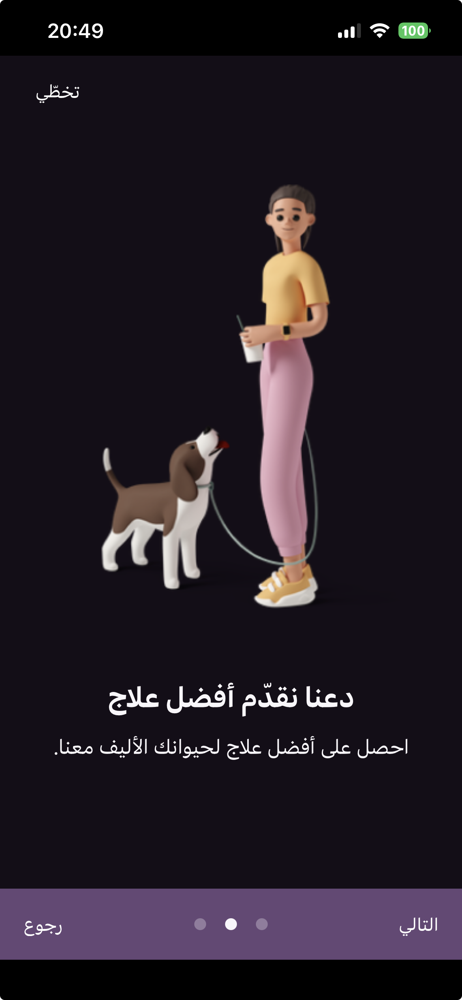 | 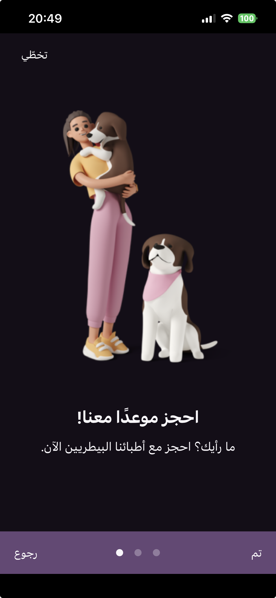 |
| --------------------- | --------------------- | ------------------ |

By default the slider follows the device writing direction (`I18nManager.isRTL`), so apps localized for Arabic, Hebrew, etc. get a right-to-left onboarding flow automatically — the footer buttons and pagination use direction-aware layout.

You can also force a direction with the `rtl` prop, independent of the device:

```jsx
<Onboarding pages={pages} rtl />
```

When the requested direction differs from the device direction, the slider (pages, dots, and progress bar) is mirrored so swiping and the indicators stay consistent. Forced mirroring applies to the declarative `pages` API; when you provide custom children, RTL follows the device direction (lay out your own screens with logical `start`/`end` styles).

A complete Arabic example is available in the example app (`example/src/rtl/Rtl.tsx`, the "Show RTL (Arabic)" entry).

## Expo Snack Examples

#### Using the custom footer component:

| 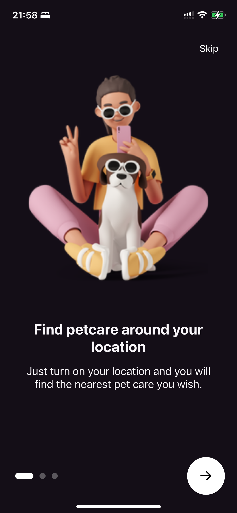 | 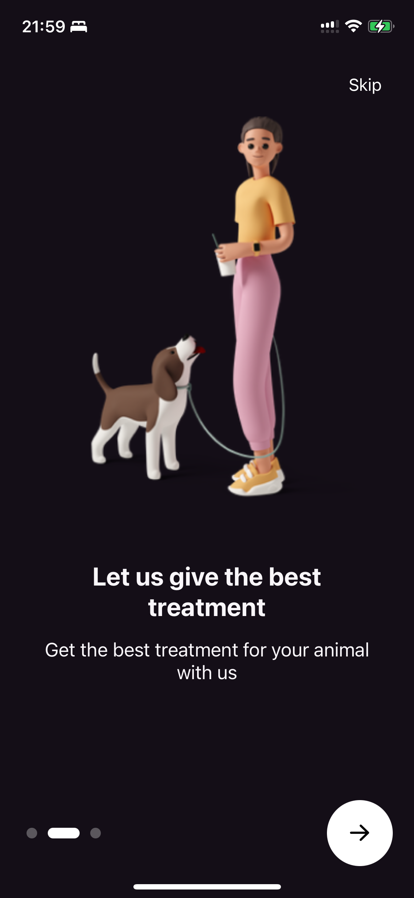 | 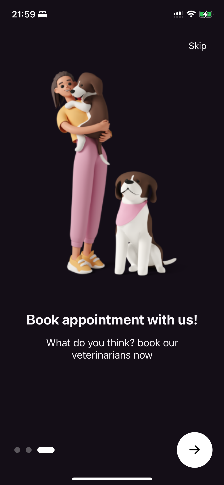 |
| --------------------- | --------------------- | ------------------ |

<a href="https://snack.expo.dev/@lekgwaraj/react-native-app-onboard-custom-pagination?platform=ios">
  
</a>

#### Using the custom page,

you can provide a custom component for each page by passing the components as children to the `Onboarding` component:

| 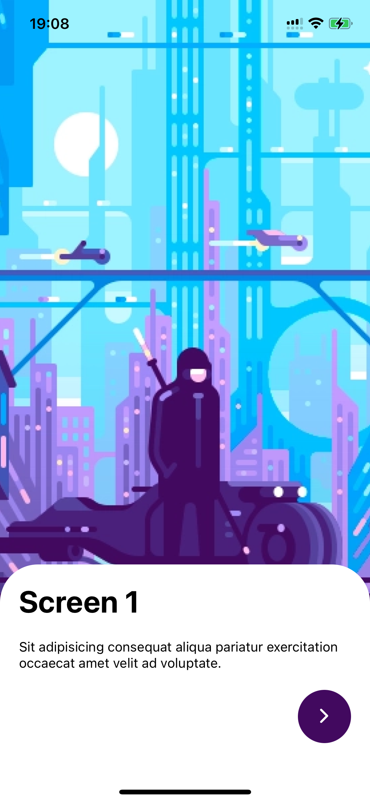 | 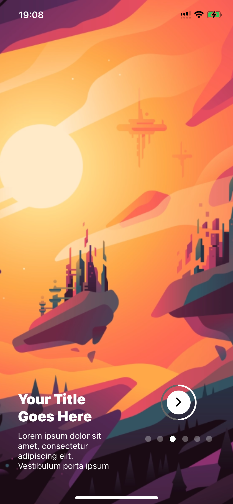 | 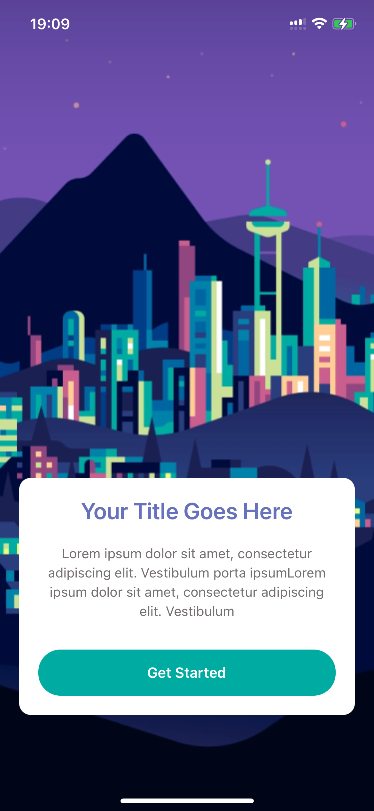 |
| --------------------- | --------------------- | ------------------ |

<a href="https://snack.expo.dev/@lekgwaraj/react-native-app-onboard-custom?platform=ios">
  
</a>

## Acknowledgements

This component library draws inspiration from the [`react-native-onboarding-swiper`](https://www.npmjs.com/package/react-native-onboarding-swiper) package.

We thank the creators and contributors of `react-native-onboarding-swiper` for their work, which has been a valuable reference in the development of this library.


## Contributing

See the [contributing guide](CONTRIBUTING.md) to learn how to contribute to the repository and the development workflow.

## License

MIT

---

Made with [create-react-native-library](https://github.com/callstack/react-native-builder-bob)
```
